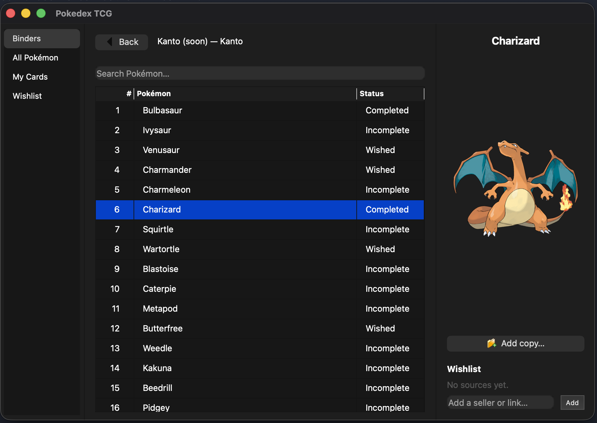

# Pokédex TCG by Mazuh

Just another Pokédex, but specifically designed to
manage my physical card collection using local files.



## Features

- Browse the National Pokédex and see each species' collection status.
- Organize your physical cards into binders.
- Record card copies with printing details, condition and ownership.
- Search the pokemontcg.io catalog to autofill a card and its image.
- Fetch a card's market prices on demand (via the tcgdex pricing aggregator), even for
  brand-new sets — resolved straight from the card's set and collector number.
- Keep a wishlist of the cards and sources you're still after.
- Ask a built-in AI assistant (Google Gemini) — optional, and only if you add a key.
- Back up your collection — the database on its own, or everything including images as
  a single zip — and get one automatically before any database upgrade.

## Instructions

### OS Requirements

macOS with [Homebrew](https://brew.sh) and Apple Clang (from Xcode Command
Line Tools: `xcode-select --install`).

Install the build dependencies:

```sh
brew install cmake ninja qt
```

- **cmake** — build system generator
- **ninja** — fast build backend
- **qt** — Qt 6 Widgets, the GUI toolkit

Apple Clang provides the C++23 compiler. GoogleTest is fetched automatically
by CMake, so there is nothing to install for it.

### Local Setup

From the project root:

```sh
# Configure (points CMake at the Homebrew Qt install)
cmake -S . -B build -G Ninja -DCMAKE_PREFIX_PATH="$(brew --prefix qt)"

# Build the app and the tests
cmake --build build

# Run the app (macOS builds a .app bundle — for camera permission; run its inner
# binary so logs stay in the terminal. Elsewhere it's a plain ./build/pokedex_tcg.)
./build/pokedex_tcg.app/Contents/MacOS/pokedex_tcg   # macOS
# ./build/pokedex_tcg                                # Linux

# Run the tests
ctest --test-dir build --output-on-failure
```

**Quick build & run** — a `dev.sh` wrapper handles the CMake/Ninja steps
(auto-configuring on first use) so day-to-day iteration is one command:

```sh
./dev.sh          # build the app and run it (default)
./dev.sh test     # build and run the test suite
./dev.sh build    # build only
./dev.sh clean    # delete the build dir (forces a fresh configure)
```

### Install (run `pokedex` from anywhere)

`dev.sh` is for iteration — an unoptimized build you run in place. When you want
a *stable* app you can launch from any directory, use `install.sh`:

```sh
./install.sh
```

This does an optimized **Release** build in its own `build-release/` directory
(kept separate from `dev.sh`'s `./build`, and skipping the test build), then
installs the binary to `/usr/local/bin/pokedex` via CMake's install rule. The
install step writes under `/usr/local`, so it runs with `sudo` and will prompt
for your password (only that step — the build runs as you).

Since `/usr/local/bin` is already on your PATH, no alias or shell-config edit is
needed — just run `pokedex` from any directory:

```sh
pokedex
```

If you can't (or don't want to) `sudo`, the script falls back to printing an
`alias` line pointing at the built binary — paste it into your shell config and
you still get a `pokedex` command, no privileges required.

Re-run `./install.sh` whenever you want that installed command to pick up the
latest changes.

### AI assistant (optional)

The app has a small built-in AI assistant, opened from **✦ AI Assistant** in the
sidebar (or the Tools menu). It is entirely optional: it does nothing until you paste
an [API key](https://aistudio.google.com/app/api-keys) into **Settings → AI assistant
API key**, which you can [create for free](https://aistudio.google.com/app/api-keys)
for the Google Gemini API. The key is stored only in your local app config and is sent
only to the assistant provider.

By default the assistant uses Google's rolling `gemini-flash-latest` model, so it always
tracks the current Flash tier. To pin a specific model instead, add an `assistant_model`
line to your config file (`~/.config/pokedex-tcg/config`) — see the code comment on
`kGeminiDefaultModel` for how to look up the [supported models](https://ai.google.dev/gemini-api/docs/models).

The provider is deliberately abstracted behind a vendor-neutral seam, so Gemini can be
swapped for another LLM without touching the rest of the app.

### Backups

Backups are written next to your collection, in a `.PokedexTCG-backups` folder beside
your workspace (change it in **Settings → Backup folder**; it must not be inside the
workspace itself). There are two kinds, both on demand from Settings:

- **Back up data** → `pokedex-data-<timestamp>.db` — just the database. Small and quick.
- **Back up everything** → `pokedex-full-<timestamp>.zip` — the database plus every
  cached image, in one self-contained archive.

The timestamp in the name is UTC, so the files sort chronologically; Settings shows the
last run of each kind in your local time. A **data backup is also taken automatically
before any database schema upgrade**, so installing a new version of the app can never
migrate your collection without a safety copy first. If that backup cannot be written,
the app refuses to start rather than upgrade unprotected — the error names the config
line to fix.

**To recover, quit the app first**, then either:

- **From a data backup** — copy the `pokedex-data-….db` file over `pokedex.db` in your
  workspace folder.
- **From a full backup** — unzip it into a new, empty folder (it already contains
  `pokedex.db` and `media/`), then point **Settings → Workspace folder** at that folder
  and restart.

The app never deletes a backup, so old ones accumulate until you remove them yourself.

## Acknowledgments

Huge thanks to these projects for making their data freely available — this
app would not exist without them:

- [**Pokémon TCG API**](https://github.com/PokemonTCG/pokemon-tcg-api)
  ([pokemontcg.io](https://pokemontcg.io)) — card catalog, printings, and images.
- [**TCGdex**](https://www.tcgdex.dev) — the market-price aggregator behind the
  on-demand price lookup (a free provider; prices are rough guidance, not a valuation).
- [**PokeAPI/sprites**](https://github.com/PokeAPI/sprites) — the official
  Pokémon artwork (fetched directly from the sprites repo).
- [**lgreski/pokemonData**](https://github.com/lgreski/pokemonData) — the
  National Pokédex species list the built-in catalog was derived from.

Please consider supporting them.

## License and Legal Disclaimer

The original source code of this project
is licensed under the [MIT License](https://github.com/Mazuh/pokedex_tcg/blob/main/LICENSE).

This is an unofficial, non-commercial, fan-made project. It is not affiliated with,
endorsed by, sponsored by, or otherwise associated with
The Pokémon Company, Nintendo, Creatures Inc., or GAME FREAK inc.

This project is provided as source code only. No publicly hosted service or
precompiled release is provided; users are responsible for downloading, configuring,
compiling, and running the software themselves.

Pokémon, the Pokémon Trading Card Game, and all related names, characters, artwork,
images, trademarks, and other intellectual property are the property of their
respective owners. No ownership of such third-party intellectual property is claimed,
and it is not covered by this project's MIT License.
